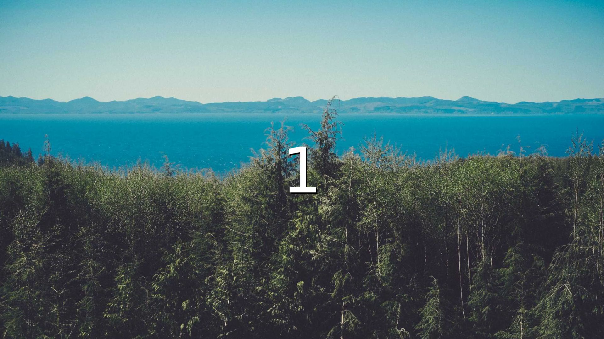
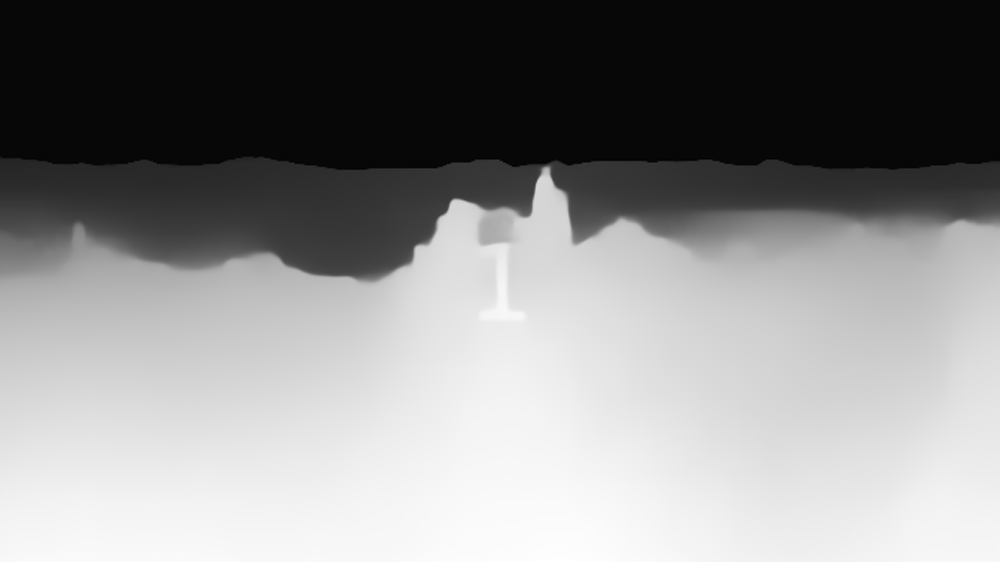
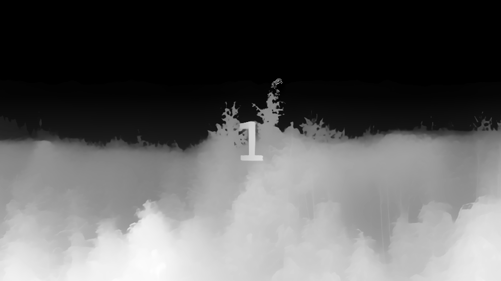
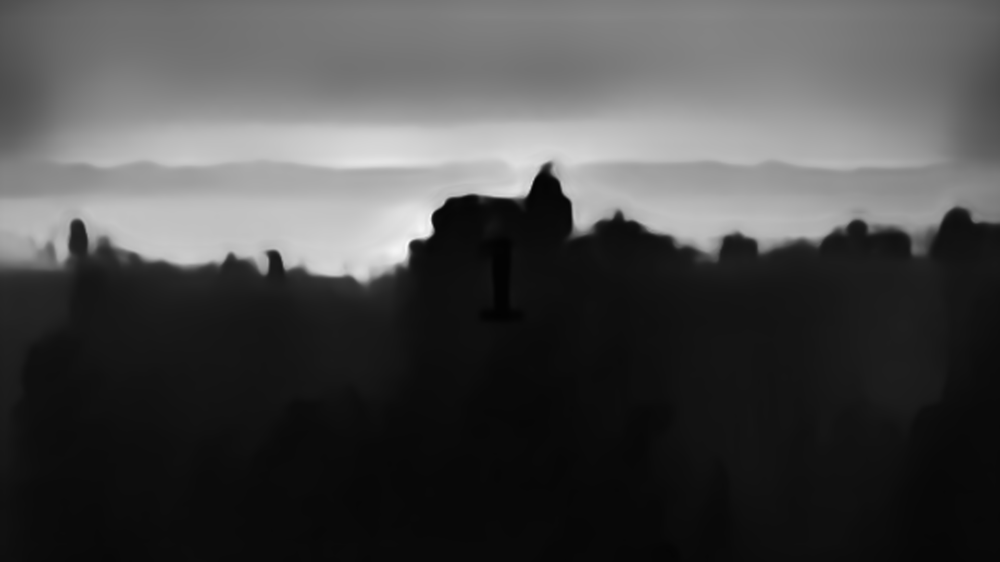
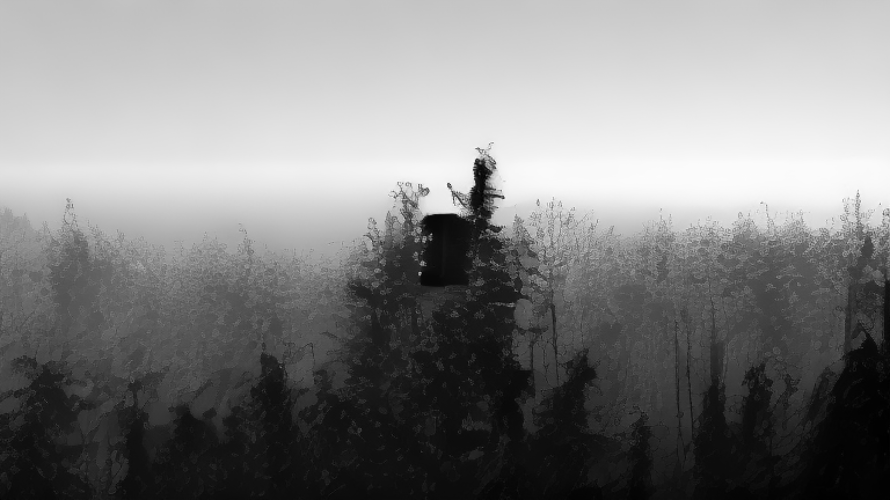

# video2depth

Depthmap video generator using machine learning

## Supported Models

| Model | Key | Description |
|-------|-----|-------------|
| MiDaS DPT-Large | `midas_large` | Default. Intel MiDaS large model |
| MiDaS DPT-Hybrid | `midas_hybrid` | Intel MiDaS hybrid model |
| MiDaS Small | `midas_small` | Intel MiDaS small (fast) model |
| Depth Anything V2 | `depth_anything_v2` | Best quality/speed ratio |
| ZoeDepth | `zoedepth` | Metric depth (real-world distances) |
| Marigold | `marigold` | Diffusion-based, highest quality, slow |

## Sample Results

| Original | MiDaS | Depth Anything V2 | ZoeDepth | Marigold |
|:--------:|:-----:|:------------------:|:--------:|:--------:|
|  |  |  |  |  |

## Requirements

- Python 3
- FFmpeg

```bash
$ pip install -r requirements.txt

# Additional for Marigold
$ pip install diffusers>=0.25 accelerate
```

## Usage

```bash
# Video to depth (default model: midas_large)
$ python video2depth.py --video [filename]
$ python video2depth.py -v [filename]

# Image to depth
$ python video2depth.py --image [filename]
$ python video2depth.py -i [filename]

# Specify model
$ python video2depth.py -v [filename] -m depth_anything_v2
$ python video2depth.py -i [filename] -m marigold
```

## Testing

```bash
# Run all tests
$ python -m pytest test_video2depth.py -v

# Run a specific test class
$ python -m pytest test_video2depth.py::TestModelRegistry -v

# Run a single test
$ python -m pytest test_video2depth.py::TestVideo2Image::test_extracts_frames -v
```

Sample files in `sample_image/` and `sample_video/` are used by the tests.

## Output

Results are saved to `out/<input_filename>/`:

| File | Description |
|------|-------------|
| `output_depth.mp4` | Depthmap video |
| `output_depth_sound.mp4` | Depthmap video + original audio |
| `output_merged.mp4` | Original + depthmap (vertically stacked) |
| `output_merged_sound.mp4` | Original + depthmap + original audio |
